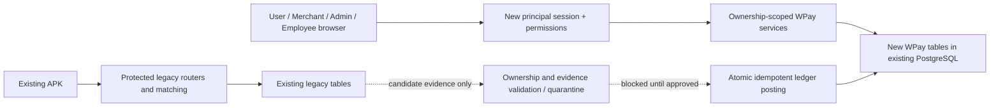

# WPay — safe integration boundaries (proposal, not implemented)

Baseline: `8162d1dd81e8e8f20b8dfcc7dcc919fdf168d541`. Read `repository-audit.md` for actual contracts and blockers. Every change described here is future work. Task 1 does not modify application code or schema.

## 1. Composition and trust boundaries

Retain CommonJS Node/Express, PostgreSQL, the current hosting/start command and plain-browser UI. Put new identities, permissions, ownership, onboarding and financial services under `lib/wpay/`; new panel templates/assets under `panels/wpay/`. Do not copy legacy modules or use browser-side filtering as security.

New principals never receive the legacy admin password/device key, legacy dashboard cookie, device credentials or provider secrets. Do not create a server proxy that calls privileged legacy APIs on their behalf. Do not mount a legacy router under a new tenant-looking prefix and assume that scopes its SQL.

Legacy sessions have no User/Merchant/Employee identity. New session middleware must use an independent cookie/key namespace and database-backed principal/session/revocation records. Use secure password hashing supported by Node crypto, cryptographically random session tokens (hash at rest), HttpOnly/Secure/SameSite cookies, CSRF protection for mutations, login throttling, expiration and revocation. Store no banking secrets. Admin roles and employee delegation must be explicit; legacy admin authentication cannot silently confer a new role.

### Exact future wrapper proposal — separate approval required

Target only `server-wrapper.js` for eventual minimal composition; keep all current initializer and middleware ordering and existing paths intact:

1. After the existing imports (`server-wrapper.js:11`), add imports for new `createWpayApiRouter` from `./lib/wpay/router` and `createWpayPanelRouter` from `./lib/wpay/panel-router`.
2. Run new schema migrations as an explicitly reviewed offline deployment step with the existing PostgreSQL database; do not add DDL to legacy initializers. The new routers must fail closed when their schema/configuration is absent. Do not change `initDb` or any device/statement initializer.
3. Immediately before existing `app.use(coreApp)` (`server-wrapper.js:65`), mount the new routers on disjoint `/api/wpay` and `/panels/wpay` prefixes. Each owns its authentication, authorization, CSRF, validation and ownership checks. Router constructors receive `{pool, env: process.env}` and derive only their own `WPAY_*` settings; they must not return legacy configuration to clients.
4. New API routes should finish errors locally with a minimal redacted response. Unknown paths under these prefixes return local 404. Serving panel files must go through their panel router; place templates outside the existing public static root. Menus may hide disallowed pages, but the API must independently enforce access.
5. Initially wire only approved nonfinancial identity/onboarding capabilities. No code path from these routers to legacy matching, OTP data, pairing or payment creation is approved by this proposal. Financial integration remains blocked by B1/B2.

These would be two new imports and two mounts in one protected file; no executable patch is supplied in Task 1. The exact diff and baseline change must be approved separately after new modules/tests exist. Re-run startup/route/auth/legacy contracts and hash checks with an explicitly reviewed baseline revision; do not auto-accept the wrapper change. Existing `server.js`, `server-runtime.js`, HTML, Android and legacy routers remain unchanged.

## 2. Ownership model (proposed additive tables)

`tenant_id` is the owning organization/account boundary, not a value trusted from request JSON. A principal is an authenticated person; a User and Merchant are distinct business entities. A Merchant may route to Admin-assigned Users through a specific assignment record, without gaining access to their banking/OTP details. A shared principal may have explicit memberships if approved later; never infer them from email/phone equality.

| Record | Proposed owner/link | Enforced boundary |
| --- | --- | --- |
| `wpay_principals`, `wpay_memberships`, sessions | principal + tenant + role; employees assigned by Admin | Session-derived principal; role/action grants checked server-side; membership changes revoke affected sessions |
| `wpay_users` | tenant + user business ID + principal membership | User reads/edits own permissible fields; administrative approval fields unavailable to User |
| `wpay_merchants` | tenant + merchant business ID + principal membership | Merchant-scoped reads/API keys/orders; User records require explicit assignment and minimal eligible projection |
| `wpay_bank_accounts` / UPI records and versions | user + tenant; verified account identity, reviewed UPI, status/version | Only owning User submits; authorized Admin reviews; sensitive edits create new pending version, never silently mutate assigned old orders |
| `wpay_device_bindings` | legacy device ID + tenant/user/account version + validity interval + evidence | Explicit reviewed mapping, one active ownership assignment where policy requires; never infer ownership solely from SIM or suffix |
| `wpay_merchant_user_assignments` | merchant tenant/ID + user tenant/ID + permitted capacity/routing scope and effective dates | Admin controls relationship; permission alone does not permit crossing unassigned ownership |
| `wpay_orders` | merchant + assignment + user/account/device snapshot + legacy link/order ID (when integration approved) | Unique durable mapping, amounts/fees/rate and routing snapshot; immutable once evidence/reservation exists |
| `wpay_statement_import_owners` | legacy import ID + owner user/account version + provenance/acceptance record | Legacy client hash is not authority. Conflicting reuse across accounts is quarantined; no ownership inferred from filename |
| `wpay_evidence` / transactions | canonical economic payment ID + account/user/merchant/order + normalized reference/amount/date + source and validator | Immutable evidence/version/source provenance; record competing sources without creating another economic payment |
| Ledger accounts, journals, entries, holds, commission entitlements | currency/unit + tenant + beneficiary + economic payment/operation ID | Query ownership enforced before returning balances; postings obey unique keys and balanced entries; no frontend arithmetic authority |

Foreign keys and unique constraints must make illegal cross-links difficult; use tenant-qualified keys where possible. The cross-tenant Merchant→User assignment is intentional and specifically authorized, not a general cross-tenant read capability. Database queries must include ownership or an explicit authorized assignment join. Do not accept owner IDs from client input as proof. Deny by default, including exports, list endpoints, counts, search, batch operations and API keys.

### Legacy mapping and migration boundary

All legacy rows begin `unmapped` for the new platform. Require an Admin-reviewed mapping with evidence, actor, timestamp, mapping version and effective dates. Unknown, ambiguous or conflicting mappings are excluded from routing and financial posting. Phone numbers, SIM aliases, VPA text and account suffixes are hints only. One device can observe multiple accounts; a device mapping alone cannot establish which account received a payment.

Mapping legacy links and provider orders to new merchants/orders requires explicit business provenance. Backfilling `success` is not a deposit or collection event by itself. Define opening balances and whether each legacy economic payment was previously accounted. Unknown prior accounting status remains quarantined to avoid duplicate credit or commission reversal. No backfill is performed now.

## 3. Hard blocker: matching cannot be securely tenant-isolated unchanged

`lib/payment-verification.js:85` and its existing-credit lookup match across all devices; account suffix is not a predicate. `lib/statement-match-router.js:67` uses global evidence and `:131` searches global pending links. No current owner/account columns make a tenant-scoped invocation possible.

Placing new sidecar ownership tables beside these queries does not make their internal selection safe. Checking a response after an unscoped matcher runs cannot undo its changes to another tenant's legacy claim/link. Hiding APIs in menus does not protect them. Adding caller-side filters or choosing a device before invocation does not constrain the SQL.

**BLOCKER B1:** do not enable new User/Merchant access to legacy statement matching, device credit matching or payment routing. Safe live reuse requires separate explicit approval to add trustworthy ownership/evidence linkage and scoped selection/locking in the protected schema and matchers. An alternative architecture must receive its own review; no unsafe proxy, SQL interception, monkey-patch or auth bypass is an acceptable substitute.

Until resolved, separate nonfinancial account/permissions work can proceed. New financial services may be designed/tested on synthetic records but must remain unmounted and unable to consume live legacy success.

## 4. Verification-to-ledger boundary

Legacy `status='success'`, `verified:true` or a match response is a **candidate observation**, not sufficient posting authority. Before any journal entry:

1. Resolve a unique new order, Merchant, assigned User, account version and device/evidence assignment valid at payment time. Verify current service permission and ownership independently of caller-supplied IDs.
2. Check INR amount exactly, canonical reference/provider transaction identity, time/currency, receiving account and credited direction; compare to immutable order allocation and expectation. Reject mismatches and ambiguous/unknown ownership.
3. Validate trusted origin. Client-submitted statement rows/file hashes and paired-device SMS alone do not prove bank receipt/account ownership. Define approved issuer/bank evidence or independently reviewed supporting evidence; preserve validator/acceptance version. Exact requirements are an open decision (B2). Do not collect bank login passwords/PINs/OTPs to obtain that proof.
4. Establish whether the same economic payment was already posted, including legacy opening-accounting reconciliation, previous APK, exact statement, missing-UTR recovery and provider observations. Use stable economic payment identity; a different import ID or source string is not a new payment.
5. Lock affected order, capacity/hold and ledger records in deterministic order within one database transaction. Use a unique idempotency key for economic success, create balanced journal entries, consume/settle capacity reservation and mark the new accounting decision atomically. Re-read on conflicts; do not retry external payments blindly.
6. Persist evidence provenance, applied amount/rate/fee snapshots, posting reason and actor. Use an outbox for notifications after commit; replaying notification or ledger consumption must not duplicate financial effects. No automatic rollback of an actual payment on a transport timeout.

Never use OTP event data, diagnostic raw JSON, user proof submission, app return status or `/transaction-result` as successful payment evidence. PhonePe `statusVerified:true` also covers FAILED/EXPIRED; successful provider evidence additionally requires COMPLETED and validated assigned order/account context.

### First posting / recovery decision table

| Existing accounting state | Validated evidence | New effect |
| --- | --- | --- |
| Definitely unposted | `paired_device_credit_sms` and accepted ownership/evidence | One success posting under approved normal commission policy; consume capacity once; credit Merchant net collection once |
| Definitely unposted | `bank_statement_upload` first reveals missed incoming payment | One success posting; consume matched amount from User capacity once; User pay-in commission **zero**, even though legacy recoveredUtr is false |
| Definitely unposted | `bank_statement_missing_utr_recovery` | Same zero-commission rule and one posting; do not treat later exact replay as normal commission eligibility |
| Already posted | Any matching APK/statement repeat | Link additional evidence/audit only; no second deduction, merchant credit or entitlement; do not silently reverse prior commission |
| Unknown/conflicting | Any source | Quarantine/reconcile; no auto-post, no auto-release and no retroactive commission correction |

One posting transaction must encompass merchant order success in new accounting, User capacity consumption, Merchant collection/fee entries and zero-or-normal commission entitlement. Legacy tables may already have success: the new transaction records accepted accounting once; it must not independently toggle legacy outcomes as a workaround.

## 5. Exact money, capacity and balances

- Use integer INR paisa and explicitly configured USDT atomic units, or PostgreSQL NUMERIC plus exact decimal arithmetic. Serialize exact values as decimal strings. Do not use binary floating-point balances or `Number` to perform ledger conversions. Network/token precision, rate precision, rounding direction and reconciliation of residuals must be explicit policies.
- Capture each User's configured fixed USDT rate and applicable commission/fee versions at operation acceptance/reservation; preserve the original snapshot through completion. Later rate changes affect later operations only. Fees and conversion displays must trace to that same snapshot.
- Model capacity movements and holds separately from cash ledger accounts. A confirmed accepted deposit adds capacity according to the snapshotted conversion rule. Successful pay-in consumes it. Approved/completed payout and parking restore it once at the agreed evidence-backed transition. A pending submission or proof is not completed payment and cannot create restoration.
- Available capacity = posted capacity remaining minus active pay-in reservations. Under a row lock (or atomic conditional update plus unique reservation), ensure sufficient shared capacity before creating a link/allocation. Two Merchants assigned to the same User compete for the same remaining capacity. A Merchant's eligible set is Admin-assigned, active, approved/verified and unblocked Users only.
- Pay-in example in the same capacity unit: posted remaining 1000, hold 300 → available 700. Success consumes posted 300 and closes hold 300 in one transaction → posted 700, hold 0, available 700. Never deduct the hold a second time.
- Merchant balance derives from immutable collection, fee, payout, withdrawal, adjustment/parking and hold entries. Available = posted balance minus active reservations. Reserve principal plus applicable fees once on payout/withdrawal acceptance. Completion posts the debit and clears its hold atomically; failure/expiry release requires policy and evidence. Do not subtract a reserved amount both in balance and again as an active hold.
- Commission INR and USDT are displays of one entitlement. Reserve/debit that entitlement once for either withdrawal currency; recompute both available displays from the same residual entitlement and recorded rate. Competing currency withdrawals lock the same entitlement. Do not maintain two independent withdrawable pots.
- Financial events use unique operation keys, immutable snapshots and append-only corrections with actor/reason, never silent edits to historical posted money.

## 6. Failure and release states

Proposed generic lifecycle: `requested → reserved → processing → confirmed → posted`; alternatives `rejected`, `expired_unpaid`, `evidence_disputed`, `reconciliation_required`. State transition guards and permissions are server-side.

A submitted proof can reserve funds but cannot mark completion. A rejected proof does not prove no payment occurred. Keep disputed evidence/possible external debit under reconciliation hold until an authorized, evidence-backed resolution. Late successful payments after capacity release are quarantined for the approved late-payment policy; do not oversubscribe by silently posting negative available capacity or ignore actual money received. Exact release/quota/restoration rules are open decisions in the implementation plan.

## 7. Required acceptance gates

- Two principals with different owners cannot read/write/list/export each other's accounts, devices, orders, statements, ledger entries or credentials. Assignment grants only the minimum routing view.
- Employee cannot assign own permissions, mint Admin credentials, choose another tenant, bypass first-login reset, or approve actions outside their checked module/action grants. Permission changes take effect server-side and are audited.
- Cross-account evidence with identical UTR/amount/date never settles the wrong order. Ambiguous mapping fails closed. These must be integration tests after approved legacy changes, not assertions that the current legacy code passes.
- Concurrent reservations, source replay, crash/retry, proof dispute, late success and mixed-currency withdrawal conserve exact balances and produce one economic posting.
- Legacy file hashes and baseline endpoint/URI/checkout/parser contracts remain green except any separately approved, explicit baseline/behavior revision.
